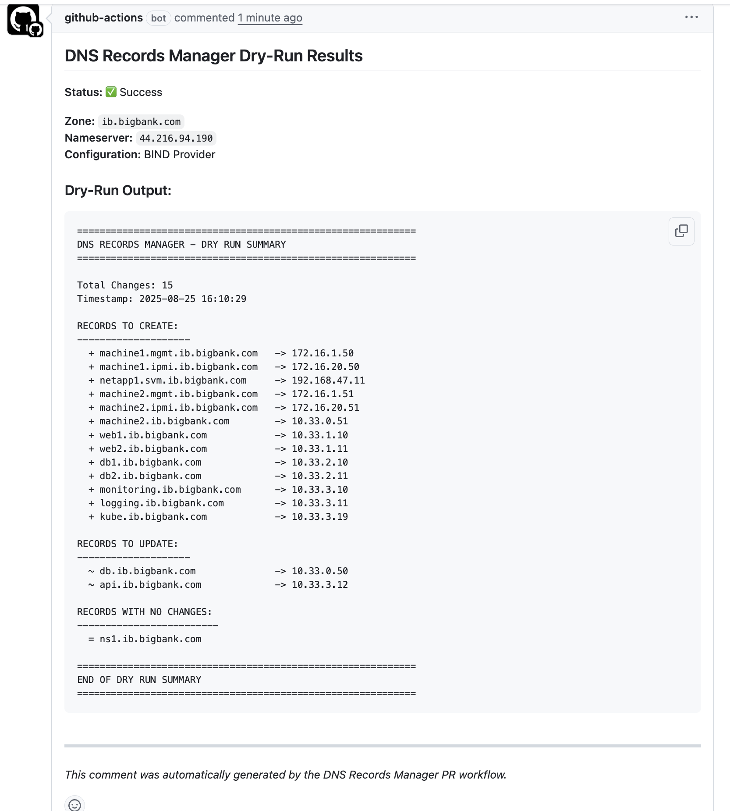
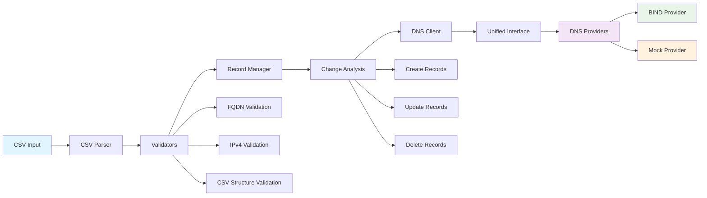
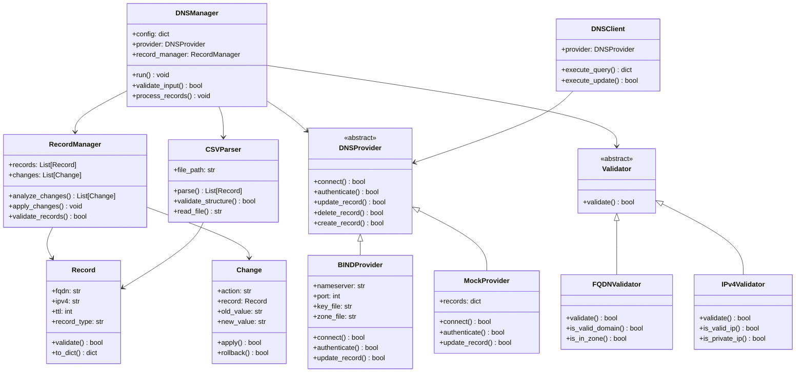
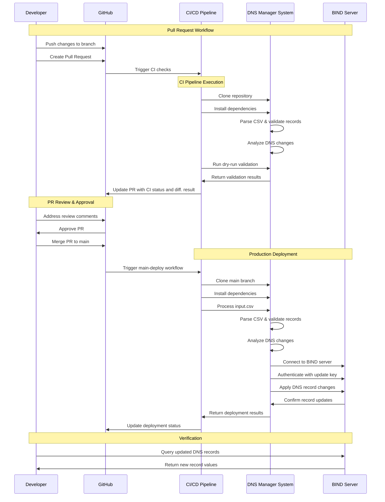

# DNS Records Manager

<p align="left">
  <a href="https://github.com/hrishin/dns-records/actions/workflows/main-deploy.yml">
    
  </a>
  <a href="https://github.com/hrishin/dns-records/actions/workflows/docker-publish.yml">
    
  </a>
</p>


## Overview

A comprehensive, enterprise-grade automation solution for managing DNS records in the `ib.bigbank.com` zone. Provides idempotent, safe, and auditable DNS record management through CSV file input.

## Key Features

- **Idempotent Operations**: Only updates records that have actually changed
- **Zone Protection**: Never modifies records outside the specified zone
- **Dry Run Mode**: Preview all changes before applying them
- **CSV Input Processing**: Simple CSV format with FQDN and IPv4 columns
- **Multi Provider Support**: BIND, Mock provider, and extensible architecture
- **Comprehensive Logging**: Detailed audit trail of all operations

### Prerequisites
- Python 3.8+
- SOPS: `brew install sops`
- Age: `brew install age`
- GNU Make
- Docker/Podman (for running the BIND DNS server container locally)

### Installation

```bash
# Clone and setup
git clone <repository-url>
cd dns-records-manager
make install

# Configure
cp configs/config.example.yaml configs/config.yaml
# Edit configs/config.yaml with your settings
```

### Basic Usage

```bash
# Process DNS records
python main.py --csv input.csv --zone ib.bigbank.com

# Preview changes (dry run)
python main.py --csv input.csv --zone ib.bigbank.com --dry-run

# Install and use as command
make install-package
dns-manager --csv input.csv --zone ib.bigbank.com
```

## Input CSV Format

The system accepts a CSV file with FQDN and IPv4 columns:

```csv
FQDN,IPv4
machine1.mgmt.ib.bigbank.com,172.16.1.50
machine1.ipmi.ib.bigbank.com,172.16.20.50
db.ib.bigbank.com,10.33.0.50
netapp1.svm.ib.bigbank.com,192.168.47.11
```

## User Guide - Updating UP Addresses 

To update DNS records in the DNS system, follow the steps below:

### 1. Checkout the `main` branch and pull the latest ccode

To ensure you are working with the latest code before making changes, follow these steps:

1. **Checkout the `main` branch**  
   ```bash
   git checkout main
   ```

2. **Pull the latest changes from the remote repository**  
   ```bash
   git pull origin main
   ```

3. **Create a new branch for your update** 

   Replace `your-branch` with a descriptive branch name:
   ```bash
   git checkout -b your-branch
   ```

You are now ready to make changes to `input.csv` to make DNS records changes.


### 2. Modify the CSV File
Edit `input.csv` to reflect the new UP addresses:

User could Add, Edit or Delete records.

```csv
FQDN,IPv4
up1.ib.bigbank.com,192.168.1.100
up2.ib.bigbank.com,192.168.1.101
up3.ib.bigbank.com,192.168.1.102
```

### 3. Validate Changes
Run a dry-run to preview what will be updated:

```bash
python main.py --csv input.csv --zone ib.bigbank.com --dry-run
```

### 4. Apply Changes
Execute the updates commite the change to your branch,
raise the the pull requests.

#### Committing and Pushing Changes

1. **Stage your changes**  

   Make sure you have saved your edits to `input.csv` (and any other files you changed):

   ```bash
   git add input.csv
   ```

2. **Commit your changes**  
   Write a clear commit message describing your update:

   ```bash
   git commit -m "Update UP addresses in input.csv"
   ```

3. **Push your branch**  
   Push your branch to the remote repository (replace `your-branch` with your branch name):

   ```bash
   git push origin your-branch
   ```

4. **Open a Pull Request**  
   Go to your repository on GitHub and open a Pull Request (PR) from your branch to `main`.

5. **Wait for CI checks**  
   The CI will automatically run a dry-run and show the results in your PR. If only `input.csv` was changed.

    Following is an example of change output.
    <br>
    
    <br>

6. **Merge after review**  
   Once your PR is approved and checks pass, merge it to apply the DNS changes.

   You can view the deployment workflow here: [Main Deploy GitHub Action](.github/workflows/main-deploy.yml)


### 5. Verify Updates
Check that the DNS records have been updated correctly:

```bash
dig up1.ib.bigbank.com
dig up2.ib.bigbank.com
```

## Configuration

Create a `config.yaml` file with your DNS provider settings:

```yaml
dns_providers:
  bind:
    nameserver: 192.168.1.10
    port: 53
    key_file: /etc/bind/rndc.key
    key_name: rndc-key
    zone_file: /etc/bind/zones/ib.bigbank.com.zone

default_provider: bind
logging:
  level: INFO
  file: dns_manager.log
```

## CLI Options

- `--csv, -f`: CSV file containing DNS records (required)
- `--zone, -z`: DNS zone to manage (required)
- `--config, -c`: Configuration file path (default: configs/config.yaml)
- `--dry-run`: Show what would be changed without making changes
- `--verbose, -v`: Enable verbose logging
- `--output-file`: Save dry-run output to file

## Developmand and Local demo

For detailed local development, testing, and advanced usage instructions, see the [Development Guide](docs/Development.md).

## Architecture

### Service components

<br>
<br>

### Class Structure

<br>
<br>

### Deployment Flow

<br>
<br>

## Future Enhancements

- DNSSEC support
- Geographic routing
- Load balancing integration
- REST API service for DNS management over the CSC file
- Configuration management tools integration
- Monitoring systems integration
- Supporting differnt DNS records types
